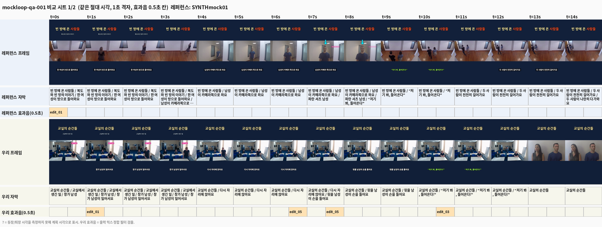

# mockloop — 합성 레퍼런스로 검증한 "레퍼런스 → 측정 → 프리셋 → 렌더 → QA" 전 과정 (SYNTHETIC)

> **이 문서의 모든 레퍼런스 영상·측정값은 SYNTHETIC(합성)이다.** 실제 채널 영상은 한 편도 쓰지 않았다
> (YouTube/TikTok/Instagram 접근은 이 환경의 정책상 막혀 있음). "레퍼런스 채널"은 우리 렌더러가
> 참값을 알고 있는 프리셋(`presets/mocktruth`, preset_id `mocktruth-v1`)으로 만든 5편이다.
> 모든 작업은 scratch 프로젝트(아래 `$S`)에서 했고 실제 `presets/joshuamagazine` 에는 측정값을 쓰지 않았다.
> 소리는 전부 기계 측정이다 — 사람이 들어서 확인한 것은 하나도 없다.

## 1. 목적

실제 레퍼런스를 받을 수 없는 상태에서, 분석기 → 측정(n/p10/p50/p90) → `preset apply-measurements` →
렌더 → `qa run --reference` 로 이어지는 사슬이 **끝까지 돌아가는지**, 그리고 **각 분석기가 참값을 얼마나
맞히는지**를 확인한다. 참값을 아는 가짜 레퍼런스로 돌리면, 틀린 값은 곧바로 분석기 결함이거나 방법의
한계이므로 그 자리에서 원인을 가를 수 있다.

## 2. 무엇이 합성인가

| 대상 | 내용 |
|---|---|
| 레퍼런스 영상 5편 | `episodes/mockref-001..005` 를 `mocktruth` 프리셋으로 렌더한 MP4 (16.6–18.6 s, 1080×1920, 30 fps, H.264 + AAC-LC 48 kHz ~200 kb/s). scratch 의 `presets/joshuamagazine/reference/videos/SYNTHmock01..05.mp4` 로 등록 |
| 참값 스타일 | `presets/mocktruth/preset.yaml` (아래 표) — 실제 채널의 스타일이 아님 |
| 원본 소스 | Intel 샘플 영상 2개(CC BY 4.0, 무음, 12 fps: people-detection, face-demographics-walking-and-pause)에 espeak-ng TTS 대사를 얹은 `assets/test/sources/{people_voice,face_voice}.mp4`. 대사는 화면 인물의 말이 아님 |
| 음악·효과음 창고 | scratch `assets/library/music`(bed_b = 참 곡, bed_a = 방해 곡), `assets/library/sfx`(생성 효과음의 이득·EQ 변형 6개) |
| 스냅샷 | `reference/latest100.json` — status ok, 가짜 id 5개, `synthetic: true`, 조회수 없음(null) |
| 포맷 라벨·수동 관찰 | `format_labels.csv`, `manual_observations.csv` — labeled_by `mockloop (synthetic truth)`: 우리가 만든 구조를 그대로 적은 것(분석기 정확도가 아님) |

참값 스타일(글자):

| 역할 | 글꼴 | size_px | 색 | 외곽선 | 박스 | 등장/퇴장 |
|---|---|---|---|---|---|---|
| title | NanumGothic ExtraBold | 96 | #FFF3B0 | 5 | 없음 | none/none(영상 전체) |
| description | Pretendard Bold | 44 | #CFE8FF | 4 | 없음 | fade/none |
| situation | Pretendard ExtraBold | 60 | #FFFFFF | 5 | 검정 0.55, pad 18/8 | pop/none |
| speaker | Pretendard Bold | 38 | #FFFFFF | 0 | #E6007E 0.85, pad 16/6 | fade/fade |
| dialogue | Pretendard ExtraBold | 58 | #9CFF57 | 5 | 없음 | none/none |
| reaction | Pretendard Black | 110 | #FF4D4D | 6 | 없음 | fade/fade |

그 밖: 확대 1.35×/0.4 s(영상별 1.30–1.38, 0.36–0.44), 정지 0.5 s(0.45–0.60), flash 0.14–0.18 s, crossfade 0.25/0.35 s,
느린 재생 0.5×, 화살표(#00E5FF, 140 px, 외곽선 5), BGM bed_b 구간 5.0 s·페이드아웃 1.0 s, 덕킹 8 dB/0.1 s/0.35 s,
효과음 whoosh·ding·pop(영상별 3–5개), 말투 해요체. 글꼴이 TTF 인 Google 글꼴(Black Han Sans 등)은 렌더러가 거부해서
(libass 가 TTF 를 PostScript 이름으로 못 찾음 — 10절 1) 참값 글꼴은 OTF/CFF 로 골랐다.

## 3. 방법

1. `docs/validation/mockloop/build_scratch.py $S` — scratch 프로젝트, mocktruth 프리셋, 모의 5편 plan.
2. `python -m shortkit episode all mockref-00N` (5편 렌더).
3. `register_reference.py snapshot` → `ref download --ids …`(이미 있는 파일 등록) → 분석 사슬:
   `ref analyze --set downloaded`, `ref audio-analyze --all`, `ref classify prepare` → `register_reference.py labels` →
   `ref classify build`, `ref aggregate`, `register_reference.py manual` → `ref manual-aggregate`,
   `ref sfx-catalog --latest-n 5`, `ref sfx-map`, `ref audio-measure`, `ref fonts --jobs 3`,
   `preset apply-measurements`, `preset sync`, `preset audit`. 결함을 고칠 때마다 해당 단계부터 다시 돌렸고, 마지막에는
   말소리 구간(`audio-analyze`)과 확정 글꼴(`fonts` → apply)을 반영하도록 글자 분석을 다시 돌린 뒤 집계·적용했다(11절 순서).
4. `accuracy.py truth` — 참값을 **렌더 산출물에서** 다시 계산(plan·resolved.json·render_report·stem). 예: 박스·여백은
   렌더된 자막 bbox, BGM 이득은 적용 이득 + (프로그램 LUFS − 믹스 LUFS), 음량은 출력 MP4 의 실측(프리셋의 목표값이 아님).
5. `accuracy.py compare` — 측정 파일(`measurements/*.json`)과 비교해 `pass / fail / unmeasured / not_exhibited /
   false_positive` 로 판정. 수치 키는 **대표값과 p10·p50·p90 이 모두** 허용 오차 안이어야 pass.
   영상 수보다 많은 영상에서 측정되면(없는 것을 봄) fail.
6. 닫힌 고리: `closeloop.py plan` → `episode all mockloop-qa-001` → `qa run --reference …/SYNTHmock01.mp4 --reference-id SYNTHmock01`.

### 허용 오차(측정 전에 정함)

| 계열 | 허용 | 계열 | 허용 |
|---|---|---|---|
| exact(범주·불리언·글꼴 이름) | 같아야 함 | canvas_px | ±4 px |
| anchor_px / margin_px | ±6 px | size_rel(크기·폭) | ±5 % |
| outline_px | ±1 px | pad_px | ±2 px |
| alpha | ±0.05 | color_rgb | RGB 거리 ≤ 30 |
| line_spacing | ±0.05 | chars(글자 수) | ±1 |
| frames_s(모션 길이) | ±0.05 s | timing_s(자막 시각) | ±0.07 s |
| lead_s | ±0.1 s | zoom_scale | ±0.03 |
| speed | ±0.05 | lufs / tp_db | ±0.5 |
| bgm_gain_db | ±1 dB | tempo | ±0.01 |
| section_s | ±0.1 s | duck_depth_db / attack / release | ±1.5 dB / ±0.05 s / ±0.1 s |
| bgm_fade_s | ±0.2 s | orig_fade_s / sil_fade_s | ±0.02 / ±0.03 s |
| sfx_gain_db | ±2 dB | duration_s | ±0.1 s |
| 장식(크기 비율 / 외곽선 / 깜빡임) | ±5 % / ±1.5 px / ±0.1 Hz | | |

허용 오차는 이번 검증 중 한 번도 넓히지 않았다.

## 4. 정확도 결과 (키 222개)

최종: **pass 153 / fail 11 / 못 잼 30 / 참값에 없음(not_exhibited) 28 / 없는 것을 봄(false_positive) 0** (키 222개).
참고로 1차 결함 수정(영역·크로스페이드·확대·속도·효과음 분할, 8절 a–f) 뒤 첫 전체 비교는
pass 136 / fail 18 / 못 잼 36 / not_exhibited 27 / false_positive 5 였고, 나머지 결함(8절 g–p)을 고친 뒤가 위 숫자다.

| 키 묶음 | pass | fail | 못 잼 | not_exhibited |
|---|---|---|---|---|
| canvas (크기·영상 영역·배경·여백) | 13 | 0 | 0 | 0 |
| structure (길이 분포·첫 자막) | 5 | 0 | 0 | 0 |
| decorations (화살표 자동 검출 + 수동 관찰 집계) | 8 | 0 | 0 | 0 |
| motion (확대·정지·전환·속도) | 7 | 3 | 1 | 0 |
| audio (음량·BGM·덕킹·원음·정적·효과음 이득) | 15 | 1 | 2 | 0 |
| text.roles.title | 15 | 0 | 5 | 5 |
| text.roles.description | 15 | 1 | 5 | 5 |
| text.roles.situation | 22 | 1 | 5 | 2 |
| text.roles.speaker | 21 | 0 | 3 | 6 |
| text.roles.dialogue | 15 | 3 | 5 | 5 |
| text.roles.reaction | 15 | 2 | 4 | 5 |
| text.tone | 2 | 0 | 0 | 0 |

`not_exhibited` = 참값 영상에 그 스타일이 나타나지 않음(예: 박스 없는 역할의 박스 색, 한 줄뿐인 역할의 줄 간격)이라
재지 않은 것이 맞는 키다. 측정기가 "없는 것을 봤다"(false_positive)는 최종 0건.

### 실패와 원인 (최종 11건)

| 키 | 참값 | 측정 | 원인 | 분류 |
|---|---|---|---|---|
| `audio.ducking.release_s` | 0.35 s | 1.36 s (p10 1.30, p90 1.62) | Demucs(보컬 분리) 없음: 대사 뒤 BGM 복귀를 (믹스 − 정렬된 BGM) 잔여로 추정하는데, 말소리 끝을 휴리스틱으로 잡아 복귀 시작이 늦게 잡힘. 깊이(7.93 vs 8 dB)·attack(0.101 vs 0.1 s)은 통과 | 방법 한계(분리기 없음) |
| `motion.freeze.hold_s` | 0.50 s (0.47–0.58) | 0.567 s (0.48–0.64) | 소스가 12 fps 라 30 fps 출력에서 같은 프레임이 2–3장씩 반복 → 정지 직전·직후의 중복 프레임이 정지에 붙어 +1–2 프레임(33–67 ms) | 방법 한계(저 fps 소스) |
| `motion.zoom.dur_s` | 0.40 s (0.376–0.432) | 0.367 s (0.30–0.41) | 같은 이유로 램프의 시작·끝 프레임이 중복 프레임에 묻힘(−1–3 프레임) | 방법 한계 |
| `motion.zoom.scale_to` | 1.35 (1.31–1.37) | 1.33 (1.28–1.46) | 확대 중에도 화면 속 사람이 걸어 다녀 끝 프레임 ECC 정합이 피사체 움직임에 끌림(한 편 1.46) | 방법 한계(움직이는 피사체) |
| `text.roles.description.size_px` | 44 | 41.3 | 크기는 글꼴 EM 크기라 **보정 글꼴**(글꼴 미확정 역할은 프리셋의 임시 글꼴 Noto Sans CJK KR Bold)의 잉크 비율로 환산됨. 참 글꼴(Pretendard Bold)로 환산한 참값 42.5 와는 −2.9 % | 글꼴 미확정의 결과(잉크 높이는 정확) |
| `text.roles.dialogue.size_px` | 58 | 55.15 | 위와 같음(보정 글꼴 Noto Sans CJK KR Black). 글꼴 환산 참값 55.6 과 −0.7 % | 〃 |
| `text.roles.reaction.size_px` | 110 | 106.0 (p10 101.3) | 위와 같음(환산 참값 106.8, −0.7 %). p10 은 두 글자 단어마다 잉크 높이가 달라서('스톱' 97 px vs '멈칫' 102 px) | 〃 + 짧은 단어 |
| `text.roles.situation.line_spacing` | 1.20 | 1.258 | 줄 간격 = 줄 중심 간격 / size_px 라 size 의 글꼴 환산이 그대로 들어감. 환산 참값 1.253 과 +0.4 % | 〃 |
| `text.roles.reaction.max_width_px` | 202 (p10 145) | 198 (p10 134) | 반응 단어 폭이 영상마다 −4…−11 px(외곽선 6 px 을 5.3 px 로 잼 + 한 글자 단어 '헉') | 경계 오차 |
| `text.roles.dialogue.quote_marks` | “ ” | “ " | 닫는 곡선 따옴표를 tesseract 가 곧은 따옴표로 읽음 | OCR 한계 |
| `text.roles.dialogue.timing.lead_s` | −0.055 (p90 −0.016) | p50 −0.014, p90 0.88 | 이번에 처음 측정됨(8절 o). 네 편 중 세 편은 ±0.05 s 안인데, SYNTHmock01 은 대사 1.2 s 전의 ding(1.15 s 음정 있는 소리)을 말소리 휴리스틱이 말로 잡아 말소리 시작이 7.59 s 로 당겨짐 | 방법 한계(분리기 없음) |

글꼴이 **동일 판정된** 두 역할은 크기가 참값과 같다: 제목 96.0(참 96, NanumGothic ExtraBold), 이름표 38.3(참 38, Pretendard Bold).
이 둘은 `ref fonts` → `apply-measurements` 뒤 글자 분석을 다시 돌려 보정 글꼴이 참 글꼴로 바뀐 결과다(첫 분석 때 제목은 98.5).
글꼴 환산(아래 표의 `글꼴 환산` 괄호)은 **판정을 바꾸지 않은 진단**이다: `size_px`·`line_spacing` 8개 키 모두 보정 글꼴 기준으로는
±1 % 안(설명만 −2.9 %)이다. 즉 분석기는 잉크 높이를 정확히 재고 있고, 틀린 것은 "어느 글꼴의 EM 인가"다. 프리셋이 보정 글꼴 그대로
렌더하면 레퍼런스와 같은 잉크 높이가 나온다.

### 못 잼(참값은 있는데 측정 안 됨) 30건의 원인

| 원인 | 키 |
|---|---|
| 글꼴 동일 판정 없음(6절) → 글꼴 이름·굵기 | description·situation·dialogue·reaction 의 `font_name`, `bold` (8) |
| 정렬·세로 기준을 가를 자료 부족(정렬: 가를 만큼의 여러 줄·폭이 다른 자막이 없음, 세로 기준: 한 줄과 여러 줄 자막이 같은 영상에 함께 있어야 함) | title·description·speaker·dialogue·reaction 의 `anchor.align`, `anchor.valign` (10) |
| 그림자 판정 불가(움직이는 영상 위라 '그림자 없음'과 구별 못 함) | title·description·situation·dialogue `shadow_px` (4) |
| 박스 뒤 배경이 평평함(캔버스 단색) → 박스 색과 투명도를 분리할 수 없음(관측 색 #070C19 만 기록) | situation `box.color`, `box.alpha` (2) |
| 외곽선이 박스 색과 구별 안 됨(분홍 박스 위 흰 글자) | speaker `outline_px` (1) |
| 제목이 0 프레임부터 끝까지 떠 있어 등장·퇴장 모션을 볼 수 없음 | title `motion_in.type`, `motion_out.type` (2) |
| 느린 램프가 없는 확대뿐(ease 판정 불가) | `motion.zoom.ease` (1) |
| 보컬 stem 없음 → 살린 대사 음량·원음 경계 경사 | `audio.original.keep_gain_db`, `audio.original.fade_s` (2) |

측정 못 한 키는 추측으로 채우지 않았다. `apply-measurements` 뒤 적용 167 / 여전히 임시값 88(scratch 프리셋; 실제 트리는 255 전부 임시값).

### 전체 표

<details><summary>키 222개 — 참값 n / p10 / p50 / p90 대 측정 n / p10 / p50 / p90</summary>

| key | 계열(허용) | 참값 | 참값 n / p10 / p50 / p90 | 측정값 | 측정 n / p10 / p50 / p90 | 판정 |
|---|---|---|---|---|---|---|
| `audio.bgm.fade_in_s` | bgm_fade_s (0.2) | 0 | 5 / 0 / 0 / 0 | 0 | 5 / 0 / 0 / 0 | pass |
| `audio.bgm.fade_out_s` | bgm_fade_s (0.2) | 1 | 5 / 1 / 1 / 1 | 1.004 | 5 / 0.996 / 1.004 / 1.012 | pass |
| `audio.bgm.gain_db` | bgm_gain_db (1) | -0.47 | 5 / -0.59 / -0.47 / -0.42 | -0.48 | 5 / -0.6 / -0.48 / -0.43 | pass |
| `audio.bgm.loop` | exact (0) | False | 5 / – / – / – | False | 5 / – / – / – | pass |
| `audio.bgm.section_start_s` | section_s (0.1) | 5 | 5 / 5 / 5 / 5 | 5 | 5 / 5 / 5 / 5 | pass |
| `audio.bgm.tempo_ratio` | tempo (0.01) | 1 | 5 / 1 / 1 / 1 | 1 | 5 / 1 / 1 / 1 | pass |
| `audio.bgm.title` | exact (0) | Synthetic Bed B | 5 / – / – / – | Synthetic Bed B | 5 / – / – / – | pass |
| `audio.bgm.track_id` | exact (0) | bed_b_original | 5 / – / – / – | bed_b_original | 5 / – / – / – | pass |
| `audio.bgm.version` | exact (0) | original | 5 / – / – / – | original | 5 / – / – / – | pass |
| `audio.ducking.attack_s` | duck_attack_s (0.05) | 0.1 | 4 / 0.1 / 0.1 / 0.1 | 0.101 | 4 / 0.097 / 0.101 / 0.108 | pass |
| `audio.ducking.depth_db` | duck_depth_db (1.5) | 8 | 4 / 8 / 8 / 8 | 7.93 | 4 / 7.636 / 7.93 / 8.147 | pass |
| `audio.ducking.release_s` | duck_release_s (0.1) | 0.35 | 4 / 0.35 / 0.35 / 0.35 | 1.359 | 4 / 1.298 / 1.359 / 1.615 | fail |
| `audio.loudness.integrated_lufs` | lufs (0.5) | -15.4 | 5 / -16.2 / -15.4 / -15.04 | -15.4 | 5 / -16.2 / -15.4 / -15.04 | pass |
| `audio.loudness.true_peak_db` | tp_db (0.5) | 0 | 5 / -0.9 / 0 / -0 | 0 | 5 / -0.9 / 0 / -0 | pass |
| `audio.original.fade_s` | orig_fade_s (0.02) | 0.06 | 4 / 0.06 / 0.06 / 0.06 | – | 0 / – / – / – | unmeasured |
| `audio.original.keep_gain_db` | lufs (0.5) | -0.65 | 4 / -1.53 / -0.65 / -0.33 | – | 0 / – / – / – | unmeasured |
| `audio.sfx.gain_db_default` | sfx_gain_db (2) | -5.73 | 20 / -6.463 / -5.73 / -3.912 | -6.4 | 17 / -6.892 / -6.4 / -2.24 | pass |
| `audio.silence.fade_s` | sil_fade_s (0.03) | 0.08 | 2 / 0.08 / 0.08 / 0.08 | 0.08 | 2 / 0.08 / 0.08 / 0.081 | pass |
| `canvas.background.color` | color_rgb (30) | #14213D | 5 / – / – / – | #12203A | 5 / – / – / – | pass |
| `canvas.background.type` | exact (0) | color | 5 / – / – / – | color | 5 / – / – / – | pass |
| `canvas.fps` | exact (0) | 30 | 5 / 30 / 30 / 30 | 30 | 5 / 30 / 30 / 30 | pass |
| `canvas.height` | exact (0) | 1920 | 5 / 1920 / 1920 / 1920 | 1920 | 5 / 1920 / 1920 / 1920 | pass |
| `canvas.safe_margin.bottom` | margin_px (6) | 364.6 | 5 / 364.6 / 394 / 402.4 | 364.6 | 5 / 364.6 / 394 / 402.4 | pass |
| `canvas.safe_margin.left` | margin_px (6) | 181.7 | 5 / 181.7 / 186 / 202.2 | 186 | 5 / 186 / 186 / 203 | pass |
| `canvas.safe_margin.right` | margin_px (6) | 130 | 5 / 130 / 130 / 180.2 | 130 | 5 / 130 / 130 / 180.2 | pass |
| `canvas.safe_margin.top` | margin_px (6) | 188.3 | 5 / 188.3 / 226 / 230.2 | 188.8 | 5 / 188.8 / 226 / 231.2 | pass |
| `canvas.video_region.h` | canvas_px (4) | 608 | 5 / 608 / 608 / 608 | 610 | 5 / 610 / 610 / 610 | pass |
| `canvas.video_region.w` | canvas_px (4) | 1080 | 5 / 1080 / 1080 / 1080 | 1080 | 5 / 1080 / 1080 / 1080 | pass |
| `canvas.video_region.x` | canvas_px (4) | 0 | 5 / 0 / 0 / 0 | 0 | 5 / 0 / 0 / 0 | pass |
| `canvas.video_region.y` | canvas_px (4) | 620 | 5 / 620 / 620 / 620 | 620 | 5 / 620 / 620 / 620 | pass |
| `canvas.width` | exact (0) | 1080 | 5 / 1080 / 1080 / 1080 | 1080 | 5 / 1080 / 1080 / 1080 | pass |
| `decorations.arrow.blink_hz` | blink_hz (0.1) | 0 | 5 / 0 / 0 / 0 | 0 | 5 / 0 / 0 / 0 | pass |
| `decorations.arrow.color` | color_rgb (30) | #00E5FF | 5 / – / – / – | #00E3FC | 5 / – / – / – | pass |
| `decorations.arrow.head_len_ratio` | deco_ratio (0.05) | 0.4 | 5 / 0.4 / 0.4 / 0.4 | 0.4 | 5 / 0.4 / 0.4 / 0.4 | pass |
| `decorations.arrow.head_width_ratio` | deco_ratio (0.05) | 0.7 | 5 / 0.7 / 0.7 / 0.7 | 0.699 | 5 / 0.698 / 0.699 / 0.7 | pass |
| `decorations.arrow.outline_color` | color_rgb (30) | #1A1A1A | 5 / – / – / – | #17191B | 5 / – / – / – | pass |
| `decorations.arrow.outline_px` | deco_outline_px (1.5) | 5 | 5 / 5 / 5 / 5 | 5 | 5 / 4.9 / 5 / 5 | pass |
| `decorations.arrow.shaft_width_ratio` | deco_ratio (0.05) | 0.2 | 5 / 0.2 / 0.2 / 0.2 | 0.2 | 5 / 0.2 / 0.2 / 0.2 | pass |
| `decorations.arrow.size_px` | deco_rel (0.05) | 140 | 5 / 140 / 140 / 140 | 140 | 5 / 139.9 / 140 / 140 | pass |
| `motion.freeze.hold_s` | frames_s (0.05) | 0.5 | 5 / 0.47 / 0.5 / 0.58 | 0.567 | 5 / 0.48 / 0.567 / 0.64 | fail |
| `motion.speed.slowmo_factor` | speed (0.05) | 0.5 | 4 / 0.5 / 0.5 / 0.5 | 0.5 | 4 / 0.5 / 0.5 / 0.5 | pass |
| `motion.transitions.crossfade.dur_s` | frames_s (0.05) | 0.3 | 2 / 0.26 / 0.3 / 0.34 | 0.317 | 2 / 0.277 / 0.317 / 0.357 | pass |
| `motion.transitions.default` | exact (0) | cut | 5 / – / – / – | cut | 5 / – / – / – | pass |
| `motion.transitions.flash.color` | color_rgb (30) | #FFFFFF | 4 / – / – / – | #FDFDFD | 4 / – / – / – | pass |
| `motion.transitions.flash.dur_s` | frames_s (0.05) | 0.16 | 4 / 0.146 / 0.16 / 0.174 | 0.167 | 4 / 0.143 / 0.167 / 0.167 | pass |
| `motion.transitions.flash.scope` | exact (0) | canvas | 4 / – / – / – | canvas | 3 / – / – / – | pass |
| `motion.zoom.dur_s` | frames_s (0.05) | 0.4 | 5 / 0.376 / 0.4 / 0.432 | 0.367 | 5 / 0.3 / 0.367 / 0.407 | fail |
| `motion.zoom.ease` | exact (0) | out | 5 / – / – / – | – | 0 / – / – / – | unmeasured |
| `motion.zoom.recenter` | exact (0) | False | 5 / – / – / – | False | 1 / – / – / – | pass |
| `motion.zoom.scale_to` | zoom_scale (0.03) | 1.35 | 5 / 1.308 / 1.35 / 1.368 | 1.329 | 5 / 1.283 / 1.329 / 1.464 | fail |
| `structure.duration_s.n` | duration_s (0.1) | 5 | – / – / – / – | 5 | 5 / 17 / 18 / 19 | pass |
| `structure.duration_s.p10` | duration_s (0.1) | 16.89 | 5 / 16.89 / 17.6 / 18.52 | 16.89 | 5 / 16.89 / 17.6 / 18.52 | pass |
| `structure.duration_s.p50` | duration_s (0.1) | 17.6 | 5 / 16.89 / 17.6 / 18.52 | 17.6 | 5 / 16.89 / 17.6 / 18.52 | pass |
| `structure.duration_s.p90` | duration_s (0.1) | 18.52 | 5 / 16.89 / 17.6 / 18.52 | 18.52 | 5 / 16.89 / 17.6 / 18.52 | pass |
| `structure.first_caption_at_s` | timing_s (0.07) | 0.3 | 5 / 0.3 / 0.3 / 0.36 | 0.3 | 5 / 0.3 / 0.3 / 0.36 | pass |
| `text.roles.description.anchor.align` | exact (0) | center | 5 / – / – / – | – | 0 / – / – / – | unmeasured |
| `text.roles.description.anchor.valign` | exact (0) | middle | 5 / – / – / – | – | 0 / – / – / – | unmeasured |
| `text.roles.description.anchor.x` | anchor_px (6) | 540 | 5 / 540 / 540 / 540 | 539 | 5 / 538.7 / 539 / 540.8 | pass |
| `text.roles.description.anchor.y` | anchor_px (6) | 430 | 5 / 427.6 / 430 / 433.2 | 432 | 5 / 428.5 / 432 / 433.7 | pass |
| `text.roles.description.bold` | exact (0) | True | 5 / – / – / – | – | 5 / – / – / – | unmeasured |
| `text.roles.description.box.enabled` | exact (0) | False | 5 / – / – / – | False | 5 / – / – / – | pass |
| `text.roles.description.color` | color_rgb (30) | #CFE8FF | 5 / – / – / – | #CFE5FA | 5 / – / – / – | pass |
| `text.roles.description.font_name` | exact (0) | Pretendard Bold | 5 / – / – / – | – | 5 / 0.922 / 0.9511 / 0.9594 | unmeasured |
| `text.roles.description.highlight_color` | color_rgb (30) | – | 0 / – / – / – | – | 0 / – / – / – | not_exhibited |
| `text.roles.description.line_spacing` | line_spacing (0.05) | – | 0 / – / – / – | – | 0 / – / – / – | not_exhibited |
| `text.roles.description.max_chars_per_line` | chars (1) | 13 | 5 / 7.8 / 11 / 12.6 | 13 | 5 / 7.8 / 11 / 12.6 | pass |
| `text.roles.description.max_lines` | exact (0) | 1 | 5 / 1 / 1 / 1 | 1 | 5 / 1 / 1 / 1 | pass |
| `text.roles.description.max_width_px` | size_rel (0.05) | 374.2 | 5 / 248.8 / 316 / 374.2 | 369.8 | 5 / 244.4 / 315 / 369.8 | pass |
| `text.roles.description.motion_in.dur_s` | frames_s (0.05) | 0.25 | 5 / 0.25 / 0.25 / 0.25 | 0.235 | 5 / 0.235 / 0.235 / 0.235 | pass |
| `text.roles.description.motion_in.offset_px` | anchor_px (6) | – | 0 / – / – / – | – | 0 / – / – / – | not_exhibited |
| `text.roles.description.motion_in.scale_from` | zoom_scale (0.03) | – | 0 / – / – / – | – | 0 / – / – / – | not_exhibited |
| `text.roles.description.motion_in.type` | exact (0) | fade | 5 / – / – / – | fade | 5 / – / – / – | pass |
| `text.roles.description.motion_out.dur_s` | frames_s (0.05) | 0 | 5 / 0 / 0 / 0 | 0 | 5 / 0 / 0 / 0 | pass |
| `text.roles.description.motion_out.type` | exact (0) | none | 5 / – / – / – | none | 5 / – / – / – | pass |
| `text.roles.description.outline_color` | color_rgb (30) | #000000 | 5 / – / – / – | #00020B | 5 / – / – / – | pass |
| `text.roles.description.outline_px` | outline_px (1) | 4 | 5 / 4 / 4 / 4 | 3.93 | 5 / 3.89 / 3.93 / 4 | pass |
| `text.roles.description.persist` | exact (0) | timed | 5 / – / – / – | timed | 5 / – / – / – | pass |
| `text.roles.description.shadow_color` | color_rgb (30) | – | 0 / – / – / – | – | 0 / – / – / – | not_exhibited |
| `text.roles.description.shadow_px` | outline_px (1) | 0 | 5 / 0 / 0 / 0 | – | 0 / – / – / – | unmeasured |
| `text.roles.description.size_px` | size_rel (0.05) | 44 | 5 / 44 / 44 / 44 | 41.3 | 5 / 41.3 / 41.3 / 41.96 | fail (글꼴 환산 42.53, 오차 -2.9%) |
| `text.roles.description.timing.min_dur_s` | timing_s (0.07) | 3.6 | 5 / 3.34 / 3.6 / 3.8 | 3.634 | 5 / 3.375 / 3.634 / 3.835 | pass |
| `text.roles.dialogue.anchor.align` | exact (0) | center | 4 / – / – / – | – | 0 / – / – / – | unmeasured |
| `text.roles.dialogue.anchor.valign` | exact (0) | middle | 4 / – / – / – | – | 0 / – / – / – | unmeasured |
| `text.roles.dialogue.anchor.x` | anchor_px (6) | 540 | 4 / 540 / 540 / 540 | 540 | 4 / 539.6 / 540 / 540 | pass |
| `text.roles.dialogue.anchor.y` | anchor_px (6) | 1478 | 4 / 1475 / 1478 / 1484 | 1480 | 4 / 1476 / 1480 / 1487 | pass |
| `text.roles.dialogue.bold` | exact (0) | True | 4 / – / – / – | – | 4 / – / – / – | unmeasured |
| `text.roles.dialogue.box.enabled` | exact (0) | False | 4 / – / – / – | False | 4 / – / – / – | pass |
| `text.roles.dialogue.color` | color_rgb (30) | #9CFF57 | 4 / – / – / – | #9CFE56 | 4 / – / – / – | pass |
| `text.roles.dialogue.font_name` | exact (0) | Pretendard ExtraBold | 4 / – / – / – | – | 4 / 0.6756 / 0.6968 / 0.8247 | unmeasured |
| `text.roles.dialogue.highlight_color` | color_rgb (30) | – | 0 / – / – / – | – | 0 / – / – / – | not_exhibited |
| `text.roles.dialogue.line_spacing` | line_spacing (0.05) | – | 0 / – / – / – | – | 0 / – / – / – | not_exhibited |
| `text.roles.dialogue.max_chars_per_line` | chars (1) | 16 | 4 / 13.3 / 15 / 16 | 17 | 4 / 12.9 / 16 / 17 | pass |
| `text.roles.dialogue.max_lines` | exact (0) | 1 | 4 / 1 / 1 / 1 | 1 | 4 / 1 / 1 / 1 | pass |
| `text.roles.dialogue.max_width_px` | size_rel (0.05) | 642 | 4 / 502 / 600 / 642 | 642 | 4 / 501.1 / 598.5 / 642 | pass |
| `text.roles.dialogue.motion_in.dur_s` | frames_s (0.05) | 0 | 4 / 0 / 0 / 0 | 0 | 4 / 0 / 0 / 0 | pass |
| `text.roles.dialogue.motion_in.offset_px` | anchor_px (6) | – | 0 / – / – / – | – | 0 / – / – / – | not_exhibited |
| `text.roles.dialogue.motion_in.scale_from` | zoom_scale (0.03) | – | 0 / – / – / – | – | 0 / – / – / – | not_exhibited |
| `text.roles.dialogue.motion_in.type` | exact (0) | none | 4 / – / – / – | none | 4 / – / – / – | pass |
| `text.roles.dialogue.motion_out.dur_s` | frames_s (0.05) | 0 | 4 / 0 / 0 / 0 | 0 | 4 / 0 / 0 / 0 | pass |
| `text.roles.dialogue.motion_out.type` | exact (0) | none | 4 / – / – / – | none | 4 / – / – / – | pass |
| `text.roles.dialogue.outline_color` | color_rgb (30) | #000000 | 4 / – / – / – | #000400 | 4 / – / – / – | pass |
| `text.roles.dialogue.outline_px` | outline_px (1) | 5 | 4 / 5 / 5 / 5 | 5.03 | 4 / 5.02 / 5.03 / 5.08 | pass |
| `text.roles.dialogue.persist` | exact (0) | timed | 4 / – / – / – | timed | 4 / – / – / – | pass |
| `text.roles.dialogue.quote_marks` | exact (0) | ["“", "”"] | 4 / – / – / – | ["“", "\""] | 4 / – / – / – | fail |
| `text.roles.dialogue.shadow_color` | color_rgb (30) | – | 0 / – / – / – | – | 0 / – / – / – | not_exhibited |
| `text.roles.dialogue.shadow_px` | outline_px (1) | 0 | 4 / 0 / 0 / 0 | – | 0 / – / – / – | unmeasured |
| `text.roles.dialogue.size_px` | size_rel (0.05) | 58 | 4 / 58 / 58 / 58 | 55.15 | 4 / 54.6 / 55.15 / 55.7 | fail (글꼴 환산 55.56, 오차 -0.7%) |
| `text.roles.dialogue.timing.lead_s` | lead_s (0.1) | -0.055 | 4 / -0.055 / -0.055 / -0.016 | -0.014 | 4 / -0.092 / -0.014 / 0.883 | fail |
| `text.roles.dialogue.timing.min_dur_s` | timing_s (0.07) | 2.425 | 4 / 2.165 / 2.425 / 2.65 | 2.417 | 4 / 2.177 / 2.417 / 2.657 | pass |
| `text.roles.reaction.anchor.align` | exact (0) | center | 5 / – / – / – | – | 0 / – / – / – | unmeasured |
| `text.roles.reaction.anchor.valign` | exact (0) | middle | 5 / – / – / – | – | 0 / – / – / – | unmeasured |
| `text.roles.reaction.anchor.x` | anchor_px (6) | 540 | 5 / 540 / 540 / 540 | 540 | 5 / 538.2 / 540 / 540.5 | pass |
| `text.roles.reaction.anchor.y` | anchor_px (6) | 1180 | 5 / 1174 / 1180 / 1184 | 1180 | 5 / 1174 / 1180 / 1185 | pass |
| `text.roles.reaction.bold` | exact (0) | True | 5 / – / – / – | – | 3 / – / – / – | unmeasured |
| `text.roles.reaction.box.enabled` | exact (0) | False | 5 / – / – / – | False | 5 / – / – / – | pass |
| `text.roles.reaction.color` | color_rgb (30) | #FF4D4D | 5 / – / – / – | #FE4C4E | 5 / – / – / – | pass |
| `text.roles.reaction.font_name` | exact (0) | Pretendard Black | 5 / – / – / – | – | 3 / 0.8861 / 0.9317 / 0.9493 | unmeasured |
| `text.roles.reaction.highlight_color` | color_rgb (30) | – | 0 / – / – / – | – | 0 / – / – / – | not_exhibited |
| `text.roles.reaction.line_spacing` | line_spacing (0.05) | – | 0 / – / – / – | – | 0 / – / – / – | not_exhibited |
| `text.roles.reaction.max_chars_per_line` | chars (1) | 2 | 5 / 1.4 / 2 / 2 | 2 | 5 / 1.4 / 2 / 2 | pass |
| `text.roles.reaction.max_lines` | exact (0) | 1 | 5 / 1 / 1 / 1 | 1 | 5 / 1 / 1 / 1 | pass |
| `text.roles.reaction.max_width_px` | size_rel (0.05) | 202 | 5 / 145 / 202 / 202 | 198 | 5 / 134 / 191 / 198 | fail |
| `text.roles.reaction.motion_in.dur_s` | frames_s (0.05) | 0.2 | 5 / 0.2 / 0.2 / 0.2 | 0.168 | 5 / 0.167 / 0.168 / 0.169 | pass |
| `text.roles.reaction.motion_in.offset_px` | anchor_px (6) | – | 0 / – / – / – | – | 0 / – / – / – | not_exhibited |
| `text.roles.reaction.motion_in.scale_from` | zoom_scale (0.03) | – | 0 / – / – / – | – | 0 / – / – / – | not_exhibited |
| `text.roles.reaction.motion_in.type` | exact (0) | fade | 5 / – / – / – | fade | 5 / – / – / – | pass |
| `text.roles.reaction.motion_out.dur_s` | frames_s (0.05) | 0.2 | 5 / 0.2 / 0.2 / 0.2 | 0.167 | 5 / 0.166 / 0.167 / 0.168 | pass |
| `text.roles.reaction.motion_out.type` | exact (0) | fade | 5 / – / – / – | fade | 5 / – / – / – | pass |
| `text.roles.reaction.outline_color` | color_rgb (30) | #000000 | 5 / – / – / – | #0C0000 | 5 / – / – / – | pass |
| `text.roles.reaction.outline_px` | outline_px (1) | 6 | 5 / 6 / 6 / 6 | 5.84 | 5 / 5.57 / 5.84 / 5.93 | pass |
| `text.roles.reaction.persist` | exact (0) | timed | 5 / – / – / – | timed | 5 / – / – / – | pass |
| `text.roles.reaction.shadow_color` | color_rgb (30) | – | 0 / – / – / – | – | 0 / – / – / – | not_exhibited |
| `text.roles.reaction.shadow_px` | outline_px (1) | 0 | 5 / 0 / 0 / 0 | 0 | 3 / 0 / 0 / 0 | pass |
| `text.roles.reaction.size_px` | size_rel (0.05) | 110 | 5 / 110 / 110 / 110 | 106 | 5 / 101.3 / 106 / 106.7 | fail (글꼴 환산 106.8, 오차 -0.7%) |
| `text.roles.reaction.timing.min_dur_s` | timing_s (0.07) | 1.4 | 5 / 1.05 / 1.4 / 1.4 | 1.401 | 5 / 1.041 / 1.401 / 1.402 | pass |
| `text.roles.situation.anchor.align` | exact (0) | center | 5 / – / – / – | center | 4 / – / – / – | pass |
| `text.roles.situation.anchor.valign` | exact (0) | middle | 5 / – / – / – | middle | 2 / – / – / – | pass |
| `text.roles.situation.anchor.x` | anchor_px (6) | 540 | 5 / 540 / 540 / 540 | 540 | 5 / 540 / 540 / 540 | pass |
| `text.roles.situation.anchor.y` | anchor_px (6) | 1480 | 5 / 1475 / 1480 / 1485 | 1480 | 5 / 1475 / 1480 / 1485 | pass |
| `text.roles.situation.bold` | exact (0) | True | 5 / – / – / – | – | 12 / – / – / – | unmeasured |
| `text.roles.situation.box.alpha` | alpha (0.05) | 0.55 | 5 / 0.55 / 0.55 / 0.55 | – | 0 / – / – / – | unmeasured |
| `text.roles.situation.box.color` | color_rgb (30) | #000000 | 5 / – / – / – | – | 0 / – / – / – | unmeasured |
| `text.roles.situation.box.enabled` | exact (0) | True | 5 / – / – / – | True | 5 / – / – / – | pass |
| `text.roles.situation.box.pad_x` | pad_px (2) | 18 | 5 / 18 / 18 / 18 | 18 | 5 / 18 / 18 / 18 | pass |
| `text.roles.situation.box.pad_y` | pad_px (2) | 8 | 5 / 8 / 8 / 8 | 8 | 5 / 8 / 8 / 8 | pass |
| `text.roles.situation.color` | color_rgb (30) | #FFFFFF | 5 / – / – / – | #FFFFFF | 5 / – / – / – | pass |
| `text.roles.situation.font_name` | exact (0) | Pretendard ExtraBold | 5 / – / – / – | – | 12 / 0.7737 / 0.9778 / 0.9814 | unmeasured |
| `text.roles.situation.highlight_color` | color_rgb (30) | #FFE400 | 2 / – / – / – | #FEE200 | 2 / – / – / – | pass |
| `text.roles.situation.line_spacing` | line_spacing (0.05) | 1.2 | 2 / 1.2 / 1.2 / 1.2 | 1.258 | 2 / 1.248 / 1.258 / 1.268 | fail (글꼴 환산 1.253, 오차 +0.4%) |
| `text.roles.situation.max_chars_per_line` | chars (1) | 15 | 5 / 14 / 15 / 15 | 15 | 5 / 14 / 15 / 15 | pass |
| `text.roles.situation.max_lines` | exact (0) | 2 | 5 / 1 / 1 / 2 | 2 | 5 / 1 / 1 / 2 | pass |
| `text.roles.situation.max_width_px` | size_rel (0.05) | 671 | 5 / 618 / 671 / 671 | 671 | 5 / 618 / 671 / 671 | pass |
| `text.roles.situation.motion_in.dur_s` | frames_s (0.05) | 0.15 | 5 / 0.15 / 0.15 / 0.15 | 0.167 | 5 / 0.15 / 0.167 / 0.167 | pass |
| `text.roles.situation.motion_in.offset_px` | anchor_px (6) | – | 0 / – / – / – | – | 0 / – / – / – | not_exhibited |
| `text.roles.situation.motion_in.scale_from` | zoom_scale (0.03) | 0.8 | 5 / 0.8 / 0.8 / 0.8 | 0.804 | 5 / 0.801 / 0.804 / 0.815 | pass |
| `text.roles.situation.motion_in.type` | exact (0) | pop | 5 / – / – / – | pop | 5 / – / – / – | pass |
| `text.roles.situation.motion_out.dur_s` | frames_s (0.05) | 0 | 5 / 0 / 0 / 0 | 0 | 5 / 0 / 0 / 0 | pass |
| `text.roles.situation.motion_out.type` | exact (0) | none | 5 / – / – / – | none | 5 / – / – / – | pass |
| `text.roles.situation.outline_color` | color_rgb (30) | #000000 | 5 / – / – / – | #010102 | 5 / – / – / – | pass |
| `text.roles.situation.outline_px` | outline_px (1) | 5 | 5 / 5 / 5 / 5 | 4.87 | 5 / 4.86 / 4.87 / 4.88 | pass |
| `text.roles.situation.persist` | exact (0) | timed | 5 / – / – / – | timed | 5 / – / – / – | pass |
| `text.roles.situation.shadow_color` | color_rgb (30) | – | 0 / – / – / – | – | 0 / – / – / – | not_exhibited |
| `text.roles.situation.shadow_px` | outline_px (1) | 0 | 5 / 0 / 0 / 0 | – | 0 / – / – / – | unmeasured |
| `text.roles.situation.size_px` | size_rel (0.05) | 60 | 5 / 60 / 60 / 60 | 57.8 | 5 / 57.8 / 57.8 / 57.8 | pass (글꼴 환산 57.48, 오차 +0.6%) |
| `text.roles.situation.timing.min_dur_s` | timing_s (0.07) | 2.6 | 5 / 2.22 / 2.6 / 2.66 | 2.6 | 5 / 2.227 / 2.6 / 2.653 | pass |
| `text.roles.speaker.anchor.align` | exact (0) | center | 5 / – / – / – | – | 0 / – / – / – | unmeasured |
| `text.roles.speaker.anchor.valign` | exact (0) | middle | 5 / – / – / – | – | 0 / – / – / – | unmeasured |
| `text.roles.speaker.anchor.x` | anchor_px (6) | 830 | 5 / 619.6 / 830 / 830 | 828.5 | 5 / 618.1 / 828.5 / 828.5 | pass |
| `text.roles.speaker.anchor.y` | anchor_px (6) | 800 | 5 / 735.2 / 800 / 800 | 800 | 5 / 735.2 / 800 / 800 | pass |
| `text.roles.speaker.bold` | exact (0) | True | 5 / – / – / – | True | 5 / – / – / – | pass |
| `text.roles.speaker.box.alpha` | alpha (0.05) | 0.85 | 5 / 0.85 / 0.85 / 0.85 | 0.85 | 5 / 0.839 / 0.85 / 0.872 | pass |
| `text.roles.speaker.box.color` | color_rgb (30) | #E6007E | 5 / – / – / – | #E5007D | 5 / – / – / – | pass |
| `text.roles.speaker.box.enabled` | exact (0) | True | 5 / – / – / – | True | 5 / – / – / – | pass |
| `text.roles.speaker.box.pad_x` | pad_px (2) | 16 | 5 / 16 / 16 / 16 | 16 | 5 / 16 / 16 / 16 | pass |
| `text.roles.speaker.box.pad_y` | pad_px (2) | 6 | 5 / 6 / 6 / 6 | 7 | 5 / 7 / 7 / 7 | pass |
| `text.roles.speaker.color` | color_rgb (30) | #FFFFFF | 5 / – / – / – | #FFFCFF | 5 / – / – / – | pass |
| `text.roles.speaker.font_name` | exact (0) | Pretendard Bold | 5 / – / – / – | Pretendard Bold | 5 / 0.9628 / 0.964 / 0.9647 | pass |
| `text.roles.speaker.highlight_color` | color_rgb (30) | – | 0 / – / – / – | – | 0 / – / – / – | not_exhibited |
| `text.roles.speaker.line_spacing` | line_spacing (0.05) | – | 0 / – / – / – | – | 0 / – / – / – | not_exhibited |
| `text.roles.speaker.max_chars_per_line` | chars (1) | 8 | 5 / 6.8 / 8 / 8 | 8 | 5 / 6.8 / 8 / 8 | pass |
| `text.roles.speaker.max_lines` | exact (0) | 1 | 5 / 1 / 1 / 1 | 1 | 5 / 1 / 1 / 1 | pass |
| `text.roles.speaker.max_width_px` | size_rel (0.05) | 211 | 5 / 185.8 / 211 / 211 | 211 | 5 / 185.8 / 211 / 211 | pass |
| `text.roles.speaker.motion_in.dur_s` | frames_s (0.05) | 0.15 | 5 / 0.15 / 0.15 / 0.15 | 0.136 | 5 / 0.134 / 0.136 / 0.144 | pass |
| `text.roles.speaker.motion_in.offset_px` | anchor_px (6) | – | 0 / – / – / – | – | 0 / – / – / – | not_exhibited |
| `text.roles.speaker.motion_in.scale_from` | zoom_scale (0.03) | – | 0 / – / – / – | – | 0 / – / – / – | not_exhibited |
| `text.roles.speaker.motion_in.type` | exact (0) | fade | 5 / – / – / – | fade | 5 / – / – / – | pass |
| `text.roles.speaker.motion_out.dur_s` | frames_s (0.05) | 0.15 | 5 / 0.15 / 0.15 / 0.15 | 0.133 | 5 / 0.122 / 0.133 / 0.135 | pass |
| `text.roles.speaker.motion_out.type` | exact (0) | fade | 5 / – / – / – | fade | 5 / – / – / – | pass |
| `text.roles.speaker.outline_color` | color_rgb (30) | – | 0 / – / – / – | – | 0 / – / – / – | not_exhibited |
| `text.roles.speaker.outline_px` | outline_px (1) | 0 | 5 / 0 / 0 / 0 | – | 0 / – / – / – | unmeasured |
| `text.roles.speaker.persist` | exact (0) | timed | 5 / – / – / – | timed | 5 / – / – / – | pass |
| `text.roles.speaker.shadow_color` | color_rgb (30) | – | 0 / – / – / – | – | 0 / – / – / – | not_exhibited |
| `text.roles.speaker.shadow_px` | outline_px (1) | 0 | 5 / 0 / 0 / 0 | 0 | 1 / 0 / 0 / 0 | pass |
| `text.roles.speaker.size_px` | size_rel (0.05) | 38 | 5 / 38 / 38 / 38 | 38.3 | 5 / 38.3 / 38.3 / 38.3 | pass (글꼴 환산 38, 오차 +0.8%) |
| `text.roles.speaker.timing.min_dur_s` | timing_s (0.07) | 1.6 | 5 / 1.3 / 1.6 / 1.92 | 1.603 | 5 / 1.302 / 1.603 / 1.921 | pass |
| `text.roles.title.anchor.align` | exact (0) | center | 5 / – / – / – | – | 0 / – / – / – | unmeasured |
| `text.roles.title.anchor.valign` | exact (0) | middle | 5 / – / – / – | – | 0 / – / – / – | unmeasured |
| `text.roles.title.anchor.x` | anchor_px (6) | 540 | 5 / 540 / 540 / 540 | 539.5 | 5 / 535.9 / 539.5 / 542.1 | pass |
| `text.roles.title.anchor.y` | anchor_px (6) | 280 | 5 / 275.2 / 280 / 285.2 | 277.5 | 5 / 272.5 / 277.5 / 282.7 | pass |
| `text.roles.title.bold` | exact (0) | True | 5 / – / – / – | True | 6 / – / – / – | pass |
| `text.roles.title.box.enabled` | exact (0) | False | 5 / – / – / – | False | 5 / – / – / – | pass |
| `text.roles.title.color` | color_rgb (30) | #FFF3B0 | 5 / – / – / – | #FFF2AF | 5 / – / – / – | pass |
| `text.roles.title.font_name` | exact (0) | NanumGothic ExtraBold | 5 / – / – / – | NanumGothic ExtraBold | 6 / 0.9695 / 0.9767 / 0.9798 | pass |
| `text.roles.title.highlight_color` | color_rgb (30) | #FF5A36 | 3 / – / – / – | #FE5934 | 3 / – / – / – | pass |
| `text.roles.title.line_spacing` | line_spacing (0.05) | 1.12 | 1 / 1.12 / 1.12 / 1.12 | 1.131 | 1 / 1.131 / 1.131 / 1.131 | pass (글꼴 환산 1.12, 오차 +1.0%) |
| `text.roles.title.max_chars_per_line` | chars (1) | 10 | 5 / 8 / 8 / 9.6 | 10 | 5 / 8 / 8 / 9.6 | pass |
| `text.roles.title.max_lines` | exact (0) | 2 | 5 / 1 / 1 / 1.6 | 2 | 5 / 1 / 1 / 1.6 | pass |
| `text.roles.title.max_width_px` | size_rel (0.05) | 711.2 | 5 / 605 / 605 / 711.2 | 699 | 5 / 596.2 / 604 / 699 | pass |
| `text.roles.title.motion_in.dur_s` | frames_s (0.05) | – | 0 / – / – / – | – | 0 / – / – / – | not_exhibited |
| `text.roles.title.motion_in.offset_px` | anchor_px (6) | – | 0 / – / – / – | – | 0 / – / – / – | not_exhibited |
| `text.roles.title.motion_in.scale_from` | zoom_scale (0.03) | – | 0 / – / – / – | – | 0 / – / – / – | not_exhibited |
| `text.roles.title.motion_in.type` | exact (0) | none | 5 / – / – / – | – | 0 / – / – / – | unmeasured |
| `text.roles.title.motion_out.dur_s` | frames_s (0.05) | – | 0 / – / – / – | – | 0 / – / – / – | not_exhibited |
| `text.roles.title.motion_out.type` | exact (0) | none | 5 / – / – / – | – | 0 / – / – / – | unmeasured |
| `text.roles.title.outline_color` | color_rgb (30) | #000000 | 5 / – / – / – | #050000 | 5 / – / – / – | pass |
| `text.roles.title.outline_px` | outline_px (1) | 5 | 5 / 5 / 5 / 5 | 4.92 | 5 / 4.84 / 4.92 / 4.96 | pass |
| `text.roles.title.persist` | exact (0) | whole_video | 5 / – / – / – | whole_video | 5 / – / – / – | pass |
| `text.roles.title.shadow_color` | color_rgb (30) | – | 0 / – / – / – | – | 0 / – / – / – | not_exhibited |
| `text.roles.title.shadow_px` | outline_px (1) | 0 | 5 / 0 / 0 / 0 | – | 0 / – / – / – | unmeasured |
| `text.roles.title.size_px` | size_rel (0.05) | 96 | 5 / 96 / 96 / 96 | 96 | 5 / 95.7 / 96 / 96 | pass (글꼴 환산 96, 오차 +0.0%) |
| `text.tone.register` | exact (0) | 해요체 | 5 / – / – / – | 해요체 | 5 / – / – / – | pass |
| `text.tone.sentence_end_examples` | exact (0) | ["와요", "가요", "져요"] | – / – / – / – | ["와요", "가요", "져요"] | 21 / – / – / – | pass |

</details>

원자료: `docs/validation/mockloop/mockloop_accuracy.json` (참값·측정·판정·허용 오차·글꼴 환산 포함).

## 5. 효과음 카탈로그·창고 매핑

참값(렌더 plan): pop 10개(5편), whoosh 5개(4편), ding 5개(5편) — 영상당 3–5개. 라이브러리에는 같은 소리의 이득·EQ 변형과
방해 파일이 섞여 있다(`lib_pop_bright`, `lib_whoosh_soft`, `lib_ding_clean`, `lib_click_quiet`, `lib_boing_eq`, `lib_boom_low`).

| 카탈로그 종류 | 판정 | 사건 수(편) | 참값 | 매핑 파일(유사도) |
|---|---|---|---|---|
| edit_05 짧은 중역 음정 타격음 0.14 s | 편집 효과음 | 9 (5) | pop 10 (5) | `lib_pop_bright.wav` (0.977) ✓ |
| edit_01 긴 고역 잡음성, 서서히 커짐 0.62 s | 편집 효과음 | 4 (4) | whoosh 5 (4) | `lib_whoosh_soft.wav` (0.973) ✓ |
| edit_03 긴 중역 음정 타격음 1.15 s | 편집 효과음 | 4 (4) | ding 5 (5) | `lib_ding_clean.wav` (0.993) ✓ |
| onsite_misc 1회성 소리 모음 | 현장음 | 2 (1) | — | 매핑 안 함(현장음) |
| silence_cut | 의도적 정적 | 1 (1) | BGM 끊김 1 (mock03) ✓ | — |

- 놓친 3개: SYNTHmock01 의 ding(7.6 s)·pop(9.0 s) — 보컬 stem 이 없어 말소리 휴리스틱 구간(7.29–10.71 s, ±0.3 s 여유) 안에 들어가
  `unmeasured_under_speech` 로 빠짐(개수는 하한값으로 기록됨). SYNTHmock02 끝의 whoosh(16.85 s) — 영상 끝에서 잘려 지문이 달라져
  `onsite_misc` 로 분류.
- 없는 것을 1개 봄: SYNTHmock02 13.43 s `onsite_misc` = 12.35 s ding 의 꼬리(1.15 s 소리가 끝나 갈 때 별도 사건으로 잘림).
- 효과음 시각: 참값과 짝지어지는 검출 사건 18개 중 편집 효과음 17개는 참값 시작 시각과 −8…+14 ms, 천천히 커지는 whoosh 하나(SYNTHmock02 0.43 s)만 +34 ms. 영상 끝에서 잘린 whoosh 는 −56 ms. 효과음 이득(`audio.sfx.gain_db_default`) 참값 −5.73 dB(−6.46…−3.91) 대 측정 −6.4 dB(−6.89…−2.24): pass.
- 이번에 없앤 가짜 종류: 수정 전에는 `onsite_04`(5회/4편)·`onsite_01`(2회/2편)이라는 "현장음"이 있었다. 모두 BGM(bed_b) 하이햇이
  AAC 로 인코딩되며 생긴 차감 잔여(8절 n). 이 가짜 현장음 때문에 새 편의 `episode validate` 가 "onsite_04 0개가 관측 범위 0.4..1.6 밖"
  오류로 막혔었다.
- BGM: 5편 모두 `bed_b_original`, 속도 1.0, 사용 구간 5.0 s, 페이드인 0 / 아웃 1.004 s, 이득 −0.48 dB(참 −0.47) — 모두 pass.
  방해 곡 bed_a 는 특징 NCC 0.12 로 후보에서 떨어짐.

## 6. 글꼴 판정

후보 19개(`assets/fonts` + 시스템, 확보 못 한 상용 글꼴 6개는 후보에 없음), 레퍼런스 해상도·비트레이트로 다시 잰 '천장'(같은 글꼴을
같은 조건으로 렌더했을 때 IoU p10)과 비교해 **동일 / 유사 / 다름**을 가른다. 문턱은 이번에 바꾸지 않았다.

| 역할 | 참 글꼴 | 1위 후보 (IoU / 천장 p10) | 2위 | 판정 | 동일이 아닌 이유 |
|---|---|---|---|---|---|
| title | NanumGothic ExtraBold | NanumGothic ExtraBold (0.977 / 0.974) | NanumGothic Bold 0.845 | **동일** ✓ | — (수정 전에는 강조색 글자 IoU 0.00 → '다름', 8절 p) |
| speaker | Pretendard Bold | Pretendard Bold (0.964 / 0.937) | Noto Sans CJK KR Bold 0.904 | **동일** ✓ | — |
| description | Pretendard Bold | Pretendard Bold (0.951 / 0.944) | Noto Sans CJK KR Bold 0.924 | 유사 | 차순위와 차이 0.028 ≤ 잡음 0.047, 쉼표 글자 IoU 낮음 |
| situation | Pretendard ExtraBold | Pretendard ExtraBold (0.978 / 0.970) | Noto Sans CJK KR Black 0.908 | 유사 | OCR 이 '카메라 쪽'의 띄어쓰기를 빠뜨려 뒤 글자 위치가 밀림(글자별 검사 실패) |
| dialogue | Pretendard ExtraBold | Pretendard ExtraBold (0.697 / 0.964) | Pretendard Bold 0.673 | 다름 | OCR 이 닫는 따옴표·'진 짜' 띄어쓰기를 틀림 |
| reaction | Pretendard Black | Pretendard Black (0.932 / 0.976) | Noto Sans CJK KR Black 0.903 | 다름 | OCR '헉'→'혁' |

6개 역할 모두 1위 후보가 참 글꼴이다. '동일'은 2개(둘 다 맞음), 틀리게 '동일'이라고 한 경우는 0개. 나머지 4개는 OCR 문구 오류가
글자별 검사를 깨뜨려 보수적으로 '유사/다름'에 머물렀다 → `font_name`·`bold` 못 잼(프리셋은 임시 글꼴 유지).

## 7. 닫힌 고리: 다른 소스로 만든 새 편 + QA

새 편 `mockloop-qa-001`: 편집은 `episodes/test-pipeline-001` 과 같은 구조(교실 영상 classroom_voice.mp4 + head-pose 영상 — 모의
레퍼런스가 쓴 두 소스와 다른 소스), 포맷 F1, test 모드. 스타일 값은 plan 에 쓰지 않고 scratch 프리셋(측정 167 키 적용)에서 받는다.
측정 스타일에 맞추느라 **편집자가 바꾼 것**(모두 내용·위치, 스타일 값 아님): 제목 '움직임 테스트 영상'→'교실의 순간들'(측정 최대 폭
699 px 에서 한 줄), 설명 '파이프라인 검증용 합성 샘플'→'교실에서 생긴 일'(max_lines 1), 상황 자막 4개를 측정 말투(해요체)로,
반응 '갸우뚱?'→'갸웃'(최대 2자), 이름표를 얼굴 위로(측정 크기에서 보호 영역을 가림), 측정 정지·전환 길이로 뒤로 밀린 효과음 2개의
시각 −0.13 s, 효과음 종류를 카탈로그 종류로(boing 은 카탈로그에 없고 종류별 개수가 차서 뺌), BGM = bed_b. `episode validate` 는
오류 0 / 경고 11 로 통과, 렌더 19.07 s, −15.4 LUFS / −0.5 dBTP(기계 측정).

`qa run --reference presets/joshuamagazine/reference/videos/SYNTHmock01.mp4 --reference-id SYNTHmock01` 결과:

| 비교 | 같다 | 다르다 | 못 잼 |
|---|---|---|---|
| **스타일 대 레퍼런스 (style_vs_reference)** | **19** | **3** | **35** |
| 참고: 실제 트리 test-pipeline-001 (측정 전 프리셋) | 0 | 0 | 53 |
| 출력 대 계획 (output_vs_plan) | 140 | 6 | 9 |

실제 트리에서는 프리셋 키가 전부 임시값이라 스타일 행이 **전부** 못 잼이었다. 측정값을 적용하자 19행이 '같다'가 됐다: 화면 구성(포맷),
제목·이름표 글꼴(동일 판정된 두 역할), 제목 크기, 상황 자막 위치·크기, 말투, 정지, 전환, 화살표 위치, 덕킹, 효과음 종류별 개수 5종과
효과음 이득, 음량, 표지 프레임.

'다르다' 3행 — 셋 다 그대로 둔다(못 잼으로 바꾸지 않음):
- `structure.duration:duration_ref` — 19.07 s 가 레퍼런스 길이 분포 16.89–18.52 s 밖. **진짜 차이**(편집이 test-pipeline 길이를 그대로 씀; validate 도 경고).
- `caption.timing:dialogue_ref` — 대사 자막 2.17 s < 레퍼런스 최소 2.42 s. **진짜 차이**(validate 경고 `caption_short`).
- `structure.duration:first_caption_ref` — 출력 0.03 s 대 레퍼런스 0.3 s. **정의 불일치**: 레퍼런스 측정은 제목·설명을 뺀 첫 시간제 자막,
  QA 는 제목을 포함(같은 정의면 출력도 0.3 s 의 이름표) → 10절 4.

'못 잼' 35행의 원인:
- **16행은 적용되지 않는 키 때문**(10절 5): 한 줄뿐인 역할의 `line_spacing`(4), 대사 외 역할의 `timing.lead_s`·영상 전체 제목의
  `min_dur_s`(5), fade/none 모션의 `scale_from`·`offset_px`(5), 박스·강조·그림자가 없는 반응 자막의 `box.*`·`highlight_color`·`shadow_color`(1),
  단색 배경의 `blur_sigma`(1).
- **18행은 레퍼런스에서 정말 못 잰 키 때문**: 글꼴 미확정(4), 정렬·세로 기준(5), 그림자·이름표 외곽선(5), 제목 모션(1), 영상 영역 fit(1, 분석기가
  내지 않는 키), 확대 ease(1), 원음 음량·경사(1, 분리기 없음).
- **1행은 계획 형식 때문**: BGM 을 파일 경로로 지정해 곡 id 대조를 못 함(`audio.bgm`).

출력 대 계획 '다르다' 6행(렌더러·QA 담당 영역, 기록만): 이름표 박스 불투명도 0.49(기대 0.85)와 등장 모션 pop(기대 fade 0.136 s),
반응 자막 글꼴 검사 IoU 0.833('갸웃'), 확대로 보호 영역(왼쪽 남성 얼굴)이 화면 밖으로 잘림(validate 도 경고), 화살표가 보호 영역을
14 % 가림(validate 경고), 표지 OCR 유사도 0.46 < 0.5. 최종 관문은 test 모드 불합격(G1 차이, G2 필수 항목 못 잼 3: 상황 자막 2개의
글꼴 검사·반응 자막 문구).

비교 시트 1쪽(축소, 원본 2156×814): 위 = 레퍼런스 SYNTHmock01, 아래 = 새 편, 같은 절대 시각 1 초 간격.
에이전트가 이미지로 본 것: 캔버스(남색 배경·영상 띠 위치)·제목 위치와 크림색·상황 자막 박스 띠·이름표(분홍 박스)·효과음 칸의
배치가 레퍼런스와 같은 틀이고, 반응 자막(2쪽, '갸웃')도 빨강 + 검은 외곽선으로 레퍼런스의 '멈칫'과 같은 모양이다.



## 8. 이번 검증에서 고친 분석기 결함 (`shortkit/reference`, 회귀 테스트 포함)

| | 결함(참값과 비교해서 드러남) | 고침 | 테스트 |
|---|---|---|---|
| a | 정지 카메라 소스에서 영상 영역을 자막 박스로 잡음 | `common.detect_video_region`: 평평한 배경의 시간 중앙값과 합침, `flat_border_color` | `test_region_of_static_camera_footage_on_flat_background`, `test_flat_border_color_refuses_non_flat_borders` |
| b | 저질감 화면의 확대 램프가 0.3–0.7 s 크로스페이드로 잡혀 확대를 가림 | `shots._crossfades`: 혼합 균일성(크로스페이드는 모든 변화 화소를 같은 비율로 섞음) | `test_zoom_ramp_is_not_a_crossfade` |
| c | 12 fps 소스의 걷는 사람을 확대로 봄 / 확대 배율 부정확 / 느린 재생 못 잡음 | `motion`: 중복 프레임 간격 규칙, ECC 로 확대 확인·끝 배율, 확대 구간을 속도 분석에서 제외, 새 프레임 간격의 규칙성(cadence)으로 속도 램프 | `test_people_walking_in_a_12fps_source_is_not_a_zoom`, `test_digital_zoom_scale_from_end_to_end_ecc`, `test_half_speed_ramp_of_a_12fps_source` |
| d | 큰 굵은 반응 단어('헉')를 OCR 이 라틴 문자로 읽음 / 한 이름표가 두 트랙으로 갈림 | `textboxes`: OCR 배율 양방향·한글 우선, `merge_split_lines` | `test_big_heavy_reaction_word_is_read_as_hangul`, `test_split_label_track_is_merged_but_consecutive_captions_are_not` |
| e | ding 꼬리에서 가짜 분할, pop 시작점이 앞의 잔여 때문에 60 ms 당겨짐, 같은 효과음의 지문이 BGM 잔여에 따라 달라짐 | `sfx_events`: 분할 규칙(감쇠 중 분할 금지), 약한 선행부 무시, 지문 꼬리 마스크·비교 범위 | `tests/reference_audio/test_mockloop_sfx.py` 6개 |
| f | `ref fonts --jobs 3` 가 0 % CPU 로 멈춤(OpenCV 사용 뒤 fork) | `typography._pmap`: spawn | (기존 CLI 테스트) |
| g | 검은 외곽선 + 거의 검은 반투명 박스: 한 줄 자막은 외곽선 '구별 불가', 두 줄 자막은 외곽선 18 px | `textboxes.measure_line`: 외곽선 바깥 경계를 고리 중앙값 색의 첫 계단(잡음 적응 문턱)으로 찾고, 그 바로 바깥의 지역 배경과 먼 배경 모두와 비교 | `test_black_outline_on_near_black_box_is_measured_and_pad_excludes_it`, `test_outline_inside_a_block_box_that_leaves_the_crop_is_bounded_by_the_local_background`, `test_white_text_on_a_light_label_box_has_no_visible_outline` |
| h | 박스 여백이 +5 px(외곽선 두께만큼) | 렌더러 계약(박스 = 외곽선 포함 잉크 + 여백)대로 보이는 외곽선을 빼고 `pad_fill_*` 도 기록 | 위 첫 테스트 |
| i | 두 줄 자막 블록의 박스를 못 찾음(안전 여백 아래쪽이 8 px 틀어짐) | `_block_box`: 두 줄 채움 합집합 주변에서 한 줄 높이 기준으로 탐색 | `test_block_box_around_a_two_line_caption` |
| j | 반응 단어 등장/퇴장 모션·시각 못 잼(시작 0.4 s 늦음) — 휴지 상태 채움 마스크에 벽 화소가 섞임 | `_text_masks(fill_hint=…)`: 측정한 글자색 근처 화소만 | `test_rest_fill_mask_keeps_only_the_measured_text_colour` |
| k | 이름표 첫 단어('파란')가 사라짐: 박스 윗변(작업 배율 3 px)에 닿아 문틀·영상 경계와 한 덩어리 → '사각 테두리'로 통째 버려짐 | `detect_lines`: 테두리형 덩어리를 벗겨(직선 구간 제거) 기존 글자 줄을 잇는 단어만 되살림 | `test_label_word_touching_a_scene_frame_is_still_detected` |
| l | 반응 단어 강조색 #5A453A(가짜) — 줄 상자 모서리의 바닥 화소가 채움에 섞임 | `_drop_corner_background`: 상자 밖으로 같은 색이 이어지고 글자색과 다른 조각 제거 | `test_background_clipped_by_the_line_box_is_not_part_of_the_fill` |
| m | 이름표 글꼴이 '동일'에서 '유사(Noto Medium)'로 떨어짐(g 수정의 부작용: bg_color 가 박스 밖 색이 됨) | 박스가 있으면 `bg_color` = 박스 안쪽 색(글꼴 마스크의 가장자리 색) | (g 테스트 + 글꼴 재판정) |
| n | 가짜 현장음 종류 2개(BGM 하이햇의 AAC 오차) | `sfx_events.mix_check`: 사건 대역에서 BGM 이 같이 ≥10 dB 솟고 잔여가 그 BGM 보다 크지 않으면 `bgm_transient_residue` 로 탈락 | `test_codec_error_on_a_bgm_hihat_is_not_an_onsite_sound` |
| o | 대사 lead_s 가 한 번도 측정되지 않음 — `original.json` 의 `speech.segments` 대신 옛 `events` 를 읽음 | `_speech_ranges` 가 `speech.segments` 를 읽음 | `test_speech_ranges_read_the_original_json_speech_segments` |
| p | 제목 글꼴이 1위(NanumGothic ExtraBold)인데 '다름' — 강조색 글자가 채움 마스크에서 빠져 그 글자 IoU 0.00 | `typography.extract_masks(alt_fill_rgb=강조색)` | `tests/typography/test_typography_core.py::test_extract_masks_adds_the_highlight_colour` |
| q | (테스트) 세 테스트 폴더를 한 번에 돌리면 typography 11개 실패 — reference_audio 의 세션 fixture 가 SHORTKIT_ROOT 를 세션 끝까지 임시 프로젝트로 둠 | `tests/reference_audio/conftest.py`: 프로젝트를 만든 뒤 바로 되돌림(각 테스트는 `project_env` 로 설정) | 세 폴더 한 번에 216 통과 |

`accuracy.py` 의 참값 정의도 두 번 고쳤다(판정을 느슨하게 한 것이 아님): 'none' 전환은 0 s 이고(제목처럼 0 프레임부터 끝까지 떠 있으면
관찰 불가 = 참값 없음), 0 프레임에서 시작하는 fade/pop 은 관찰 가능하다.

## 9. 한계

- **모의 레퍼런스가 우리 렌더러에서 나왔다.** 렌더러와 분석기가 같은 가정을 공유하면(예: 박스 = 외곽선 포함 잉크 + 여백, libass 글꼴
  크기 규약) 둘 다 틀려도 여기서는 맞게 보인다. 실제 채널 영상의 자막 도구·인코더·재압축(플랫폼 트랜스코딩)은 검증하지 못했다.
- **Demucs(보컬 분리) 가중치를 받을 수 없어** 말소리는 (믹스 − 정렬된 BGM) 잔여의 휴리스틱으로만 잡는다(`confidence: low`).
  그 결과 덕킹 release 1.36 s(참 0.35), 대사 lead_s 한 편 오염, 말소리 구간 안의 효과음 2개 누락, 살린 대사 음량·원음 경사 못 잼.
- 소스가 12 fps 라 정지·확대 길이에 ±1–3 프레임 오차가 생긴다(30 fps 원본이면 줄어들 것으로 보이나 검증하지 않음).
- 글자 크기는 보정 글꼴의 EM 크기다. 글꼴이 동일 판정되지 않은 역할은 참 크기와 다를 수 있다(잉크 높이는 맞음, 4절).
- 글꼴 판정은 OCR 문구에 기대므로, OCR 오독('멈칫'→'멈짓', '두근'→'두곧', '헉'→'혁', 닫는 따옴표)이 있으면 올바른 글꼴도
  '다름'이 된다. 판정 문턱은 낮추지 않았다(동일이라고 쓰지 않는 쪽이 안전).
- 모의 5편은 한 포맷(F1)뿐이고 길이 16.6–18.6 s, 자막 역할 6개·전환 3종·효과음 3종으로 좁다. 레퍼런스가 이보다 다양하면
  분포(p10/p90) 추정이 달라진다.
- 수동 관찰(표지·말투 이모지 등 3개 키)은 우리가 만든 구조를 적은 것이라 분석기 정확도에 넣지 않았다.
- 사람이 듣거나 본 확인은 없다. 소리는 모두 기계 측정, 화면은 비교 시트를 에이전트가 이미지로 본 것뿐이다.

## 10. 공유 코드 변경 요청 (소유 범위 밖 — 고치지 않고 기록만)

1. **렌더러(shortkit/edit): TTF 글꼴을 PostScript 이름으로 넘김** → libass 가 TTF(Google 글꼴 Black Han Sans 등)를 못 찾아 렌더 거부.
   참값 글꼴을 OTF 로 바꿔서 우회했다. 글꼴 파일 경로(fontsdir)+패밀리 이름으로 넘기거나 TTF 는 family 이름을 써야 함.
2. **렌더러: AAC 인코딩 뒤 true peak 가 한도를 넘음** — 렌더 보고서의 믹스 wav 는 5편 모두 −2.0 dBTP(한도 −2.0)인데 MP4 실측은
   4편이 −0.0 dBTP, 1편 −1.5 dBTP(AAC 오버슈트 약 2 dB). 인코딩 후 재측정·여유가 필요(원인 확인은 렌더러 담당). 덧붙여 mockref-002 는
   믹스 −16.5 LUFS 로 목표 −15 보다 1.5 LU 모자람(리미터에 묶임).
3. **편집 검증(shortkit/edit/validate.py): 현장음(onsite_sound) 종류를 plan 의 효과음 개수 범위로 검사** — 현장음은 소스 오디오에
   있는 소리라 편집자가 넣는 효과음이 아니다. 또 n=5 의 p10 보간(0.4)이 실제 관측 개수 0 을 범위 밖으로 만든다(정수 개수는 관측
   최소·최대 또는 내림/올림 필요).
4. **QA(shortkit/qa/checks.py): `first_caption_ref` 정의 불일치** — 레퍼런스 측정(`structure.first_caption_at_s`)은 제목·설명을
   뺀 첫 시간제 자막인데, QA 는 제목까지 포함한 첫 자막(0.03 s)과 비교해 '다르다'가 됨. 같은 정의(제목·설명 제외)면 0.3 s 로 같음.
5. **QA: 적용되지 않는 키가 '못 잼'을 만듦** — 예: 박스 없는 역할의 `box.color/alpha`, fade 역할의 `motion_in.scale_from/offset_px`,
   한 줄뿐인 역할의 `line_spacing`, 대사 외 역할의 `timing.lead_s`. 측정값이 그 키를 무의미하게 만들 때(박스 없음, 모션 종류, max_lines 1)
   해당 스타일 행에서 빼야 '같다/다르다'가 나온다. 이번 새 편의 style_vs_reference 못 잼 대부분이 이 경우다(7절).
6. **audit: 측정된 키 중 코드가 쓰지 않는 키**(최종 no_code 8개: `decorations.circle.*`, `decorations.box.*`, `audio.bgm.loop_xfade_s`,
   `approval.later_episodes_require_approval`; 중간에는 `text.tone.sentence_end_examples` 도) — 실제 트리에서는 측정 전이라 드러나지 않음.
   scratch 프리셋 audit 결과는 측정 167 / 못 잼 88 / no_code 8 / no_qa 0 → BLOCKED(못 잼이 남아 있으므로 당연한 결과).
7. **AGENTS.md 의 레퍼런스 사슬 순서**: `ref audio-analyze` → `ref analyze`(글자 분석이 말소리 구간으로 lead_s·대사 역할을 판정),
   `ref sfx-map` → `ref audio-measure`, `ref fonts` → apply → (글꼴이 새로 확정되면) `ref analyze --only text` 재실행(크기의 보정 글꼴).

## 11. 재현 명령

```bash
S=/tmp/…/scratchpad/mockloop            # scratch 프로젝트(아무 빈 폴더)
export PYTHONPATH=$PWD SHORTKIT_ROOT=$S OMP_THREAD_LIMIT=1
python docs/validation/mockloop/build_scratch.py $S
for n in 1 2 3 4 5; do python -m shortkit episode all mockref-00$n; done
python docs/validation/mockloop/register_reference.py snapshot
python -m shortkit ref download --ids SYNTHmock01,SYNTHmock02,SYNTHmock03,SYNTHmock04,SYNTHmock05
python -m shortkit ref audio-analyze --all          # 말소리 구간(original.json)이 글자 분석의 lead_s·역할 판정에 쓰임
python -m shortkit ref analyze --set downloaded
python -m shortkit ref classify prepare && python docs/validation/mockloop/register_reference.py labels
python -m shortkit ref classify build
python -m shortkit ref sfx-catalog --latest-n 5 && python -m shortkit ref sfx-map
python -m shortkit ref audio-measure                # sfx-map 뒤에(효과음 이득은 매핑된 파일 기준)
python -m shortkit ref aggregate
python docs/validation/mockloop/register_reference.py manual && python -m shortkit ref manual-aggregate
python -m shortkit ref fonts --jobs 3
python -m shortkit preset apply-measurements --preset joshuamagazine     # 확정 글꼴을 프리셋에
python -m shortkit ref analyze --set downloaded --only text              # 확정 글꼴로 크기 다시 환산
python -m shortkit ref aggregate
python docs/validation/mockloop/accuracy.py truth && python docs/validation/mockloop/accuracy.py compare
python docs/validation/mockloop/accuracy.py table   # 4절의 표
python -m shortkit preset apply-measurements --preset joshuamagazine
python -m shortkit preset sync --preset joshuamagazine && python -m shortkit preset audit --preset joshuamagazine
python docs/validation/mockloop/closeloop.py plan
python -m shortkit episode all mockloop-qa-001
python -m shortkit qa run --episode mockloop-qa-001 \
  --reference presets/joshuamagazine/reference/videos/SYNTHmock01.mp4 --reference-id SYNTHmock01
```

회귀 테스트: `python -m pytest tests/reference_visual tests/reference_audio tests/typography`
(이번 결함은 `tests/reference_visual/test_rv_mockloop_fixes.py`, `tests/reference_audio/test_mockloop_sfx.py`).
